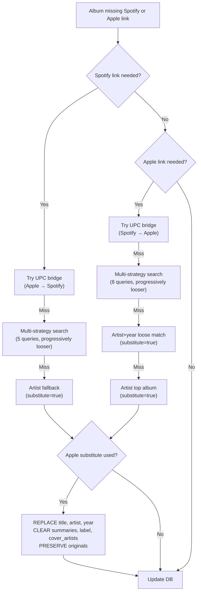
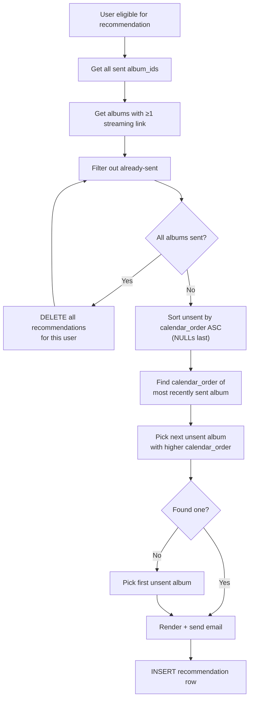

# Jazzy — Application Logic Diagrams

## Complete Application Flow

```mermaid
flowchart TB
    subgraph UserFlows["👤 User Flows (Frontend — Next.js)"]
        direction TB

        Register["/register<br/>Name + Email + Password"]
        Login["/login<br/>Email + Password"]
        ForgotPW["/forgot-password<br/>Enter email"]
        ResetPW["/reset-password<br/>New password"]
        Settings["/settings<br/>Newsletter frequency"]
        Unsub["/unsubscribe?token=..."]

        Register -->|"supabase.auth.signUp()"| SupaAuth["Supabase Auth"]
        SupaAuth -->|"DB trigger: on_auth_user_created"| CreateUser["INSERT public.users<br/>(active, weekly default)"]
        SupaAuth -->|"Sends confirmation email"| ConfirmEmail["User clicks email link"]
        ConfirmEmail -->|"GET /auth/confirm"| AuthConfirm["Verify OTP"]
        AuthConfirm -->|"type=signup"| WelcomeEmail["Send welcome recommendation<br/>via Resend"]
        WelcomeEmail --> InsertRec["INSERT recommendation"]
        AuthConfirm --> RedirectSettings["Redirect → /settings"]

        Login -->|"supabase.auth.signInWithPassword()"| SupaAuth
        Login --> RedirectSettings

        ForgotPW -->|"supabase.auth.resetPasswordForEmail()"| ResetEmail["Supabase sends reset email"]
        ResetEmail --> ClickReset["User clicks email link"]
        ClickReset -->|"GET /auth/confirm?code=..."| CodeExchange["Exchange code for session"]
        CodeExchange --> ResetPW
        ResetPW -->|"supabase.auth.updateUser()"| RedirectSettings

        Settings -->|"UPDATE users.newsletter_frequency"| UsersDB[("users table")]
        Settings -->|"supabase.rpc('delete_account')"| DeleteAcct["Delete user + auth + cascade recommendations"]
        Settings -->|"supabase.auth.signOut()"| Login

        Unsub -->|"supabase.rpc('unsubscribe_by_token')"| SetInactive["SET subscription_status = 'inactive'"]
    end

    subgraph Middleware["🔒 Auth Middleware"]
        MW["Every request"] -->|"Refresh session"| CheckAuth{"Authenticated?"}
        CheckAuth -->|"No + protected route"| Login
        CheckAuth -->|"Yes + auth page"| RedirectSettings
        CheckAuth -->|"Otherwise"| PassThrough["Continue"]
    end

    subgraph SeedPipeline["🌱 Album Seeding Pipeline (Python — manual GH Action)"]
        direction TB

        PNGs["PNG images<br/>data/png-images/"] --> Extract

        Extract["1️⃣ extract_album_data.py<br/>Gemini 2.0 Flash (vision OCR)"]
        Extract -->|"UPSERT albums<br/>(title, artist, year, label,<br/>cover_artists, calendar_order)"| AlbumsDB

        Extract --> StreamLinks["2️⃣ add_streaming_links.py<br/>Spotify API + iTunes API + UPC bridge"]
        StreamLinks -->|"UPDATE albums<br/>(spotify/apple links, substitute flags)<br/>May REPLACE metadata on substitution"| AlbumsDB

        StreamLinks --> Parallel

        subgraph Parallel["3️⃣ Run in parallel"]
            Covers["add_album_covers.py<br/>iTunes Lookup/Search"]
            Summaries["add_album_summaries.py<br/>Perplexity 'sonar' LLM"]
        end

        Covers -->|"UPDATE albums<br/>(cover_image_url)"| AlbumsDB
        Summaries -->|"UPDATE albums<br/>(artist_summary, album_summary)"| AlbumsDB
    end

    subgraph EmailPipeline["📧 Recommendation Emails (Python — daily GH Action cron 04:00 UTC)"]
        direction TB

        Cron["GitHub Actions cron trigger"] --> CheckFreq

        CheckFreq{"Eligible frequencies today?"}
        CheckFreq -->|"Always"| Daily["daily"]
        CheckFreq -->|"Monday"| Weekly["weekly"]
        CheckFreq -->|"1st of month"| Monthly["monthly"]

        Daily & Weekly & Monthly --> QueryUsers["Query active users<br/>matching frequency"]
        QueryUsers --> UsersDB

        QueryUsers --> ForEach["For each user"]
        ForEach --> GetSent["Get sent album_ids<br/>from recommendations"]
        GetSent --> PickNext{"All albums sent?"}
        PickNext -->|"Yes"| ResetHistory["DELETE all recommendations<br/>for user, restart cycle"]
        PickNext -->|"No"| SelectAlbum["Pick next unsent album<br/>by calendar_order"]
        ResetHistory --> SelectAlbum

        SelectAlbum --> AlbumsDB
        SelectAlbum --> RenderEmail["Render HTML email<br/>(email_template.py)"]
        RenderEmail --> SendResend["Send via Resend API"]
        SendResend --> RecordRec["INSERT recommendation"]
        RecordRec --> RecsDB
    end

    AlbumsDB[("albums table")]
    RecsDB[("recommendations table")]
    UsersDB[("users table")]

    subgraph ExternalAPIs["🌐 External APIs"]
        Gemini["Google Gemini 2.0 Flash"]
        Spotify["Spotify Web API"]
        iTunes["iTunes Search/Lookup API"]
        Perplexity["Perplexity API (sonar)"]
        Resend["Resend Email API"]
        SupabaseAuth["Supabase Auth"]
    end

    Extract -.-> Gemini
    StreamLinks -.-> Spotify
    StreamLinks -.-> iTunes
    Covers -.-> iTunes
    Summaries -.-> Perplexity
    SendResend -.-> Resend
    WelcomeEmail -.-> Resend
    Register -.-> SupabaseAuth
    Login -.-> SupabaseAuth
```

---

## Streaming Links — Substitute Logic Detail

```mermaid
flowchart TD
    Start["Album missing Spotify or Apple link"] --> SpotifyCheck{"Spotify link needed?"}

    SpotifyCheck -->|Yes| UPCBridge1["Try UPC bridge<br/>(Apple → Spotify)"]
    UPCBridge1 -->|Miss| MultiSearch1["Multi-strategy search<br/>(5 queries, progressively looser)"]
    MultiSearch1 -->|Miss| ArtistFallback1["Artist fallback<br/>(substitute=true)"]

    SpotifyCheck -->|No| AppleCheck

    AppleCheck{"Apple link needed?"} -->|Yes| UPCBridge2["Try UPC bridge<br/>(Spotify → Apple)"]
    UPCBridge2 -->|Miss| MultiSearch2["Multi-strategy search<br/>(8 queries, progressively looser)"]
    MultiSearch2 -->|Miss| LooseMatch["Artist+year loose match<br/>(substitute=true)"]
    LooseMatch -->|Miss| TopAlbum["Artist top album<br/>(substitute=true)"]

    AppleCheck -->|No| Done

    ArtistFallback1 & TopAlbum --> SubCheck{"Apple substitute used?"}
    SubCheck -->|Yes| Replace["REPLACE title, artist, year<br/>CLEAR summaries, label, cover_artists<br/>PRESERVE originals"]
    SubCheck -->|No| Done["Update DB"]
    Replace --> Done
```

---

## Recommendation Selection Algorithm

```mermaid
flowchart TD
    Start["User eligible for recommendation"] --> GetSent["Get all sent album_ids"]
    GetSent --> GetEligible["Get albums with ≥1 streaming link"]
    GetEligible --> Filter["Filter out already-sent"]
    Filter --> AllSent{"All albums sent?"}
    AllSent -->|Yes| Reset["DELETE all recommendations<br/>for this user"]
    Reset --> Filter
    AllSent -->|No| Sort["Sort unsent by calendar_order ASC<br/>(NULLs last)"]
    Sort --> FindLast["Find calendar_order of<br/>most recently sent album"]
    FindLast --> PickNext["Pick next unsent album<br/>with higher calendar_order"]
    PickNext --> WrapAround{"Found one?"}
    WrapAround -->|No| First["Pick first unsent album"]
    WrapAround -->|Yes| Send["Render + send email"]
    First --> Send
    Send --> Record["INSERT recommendation row"]
```
