# Jazzy Architecture

```mermaid
graph TB
    subgraph "Users"
        Browser["Browser"]
        EmailClient["Email Client"]
    end

    subgraph "Frontend — Next.js 16 (Vercel)"
        AppRouter["App Router"]

        subgraph "Pages"
            Login["/login"]
            Register["/register"]
            Settings["/settings"]
            ForgotPW["/forgot-password"]
            ResetPW["/reset-password"]
            Unsubscribe["/unsubscribe"]
            AuthConfirm["/auth/confirm"]
        end

        Middleware["Auth Middleware"]
        SupabaseClient["Supabase Client<br/>(browser + server)"]
    end

    subgraph "CI/CD — GitHub Actions"
        CronJob["send-recommendations.yml<br/>⏰ Daily 04:00 UTC"]
        SeedJob["seed-database.yml<br/>🔧 Manual trigger"]
    end

    subgraph "Backend — Python 3.13+ (uv)"
        SendRecs["send_recommendations.py"]
        EmailTpl["email_template.py"]

        subgraph "Album Seeding Pipeline (main.py)"
            direction TB
            Extract["extract_album_data.py<br/>Vision extraction"]
            Links["add_streaming_links.py<br/>Streaming URL lookup"]
            Covers["add_album_covers.py<br/>Cover art lookup"]
            Summaries["add_album_summaries.py<br/>AI summaries"]
            Extract --> Links --> Covers --> Summaries
        end
    end

    subgraph "Database — Supabase (PostgreSQL)"
        Auth["Supabase Auth<br/>(auth.users)"]
        UsersTable["users<br/>email, subscription_status,<br/>newsletter_frequency,<br/>unsubscribe_token"]
        AlbumsTable["albums<br/>title, artist, release_year,<br/>cover_image_url, streaming_links,<br/>summaries, calendar_order"]
        RecsTable["recommendations<br/>user_id → users,<br/>album_id → albums,<br/>sent_date"]
        Trigger["Trigger:<br/>on_auth_user_created"]
        RLS["Row Level Security"]
    end

    subgraph "External Services"
        Resend["Resend<br/>Email delivery"]
        Gemini["Google Gemini 2.0 Flash<br/>Vision AI"]
        Spotify["Spotify Web API<br/>Streaming links"]
        iTunes["iTunes Search API<br/>Cover art + Apple Music links"]
        Perplexity["Perplexity API<br/>AI summaries"]
    end

    %% User interactions
    Browser --> Middleware
    Middleware --> AppRouter
    AppRouter --> Login & Register & Settings & ForgotPW & ResetPW & Unsubscribe & AuthConfirm
    AppRouter --> SupabaseClient
    SupabaseClient --> Auth
    SupabaseClient --> UsersTable
    SupabaseClient --> AlbumsTable
    SupabaseClient --> RecsTable

    %% Auth flow
    Auth --> Trigger
    Trigger --> UsersTable

    %% Welcome email on signup
    AuthConfirm -->|"Welcome email<br/>(first recommendation)"| Resend
    Resend --> EmailClient

    %% Daily recommendation cron
    CronJob --> SendRecs
    SendRecs --> UsersTable
    SendRecs --> AlbumsTable
    SendRecs --> RecsTable
    SendRecs --> EmailTpl
    SendRecs --> Resend

    %% Seeding pipeline
    SeedJob --> Extract
    Extract --> Gemini
    Links --> Spotify
    Links --> iTunes
    Covers --> iTunes
    Summaries --> Perplexity
    Summaries --> AlbumsTable

    %% RLS
    RLS -.-> UsersTable
    RLS -.-> AlbumsTable
    RLS -.-> RecsTable

    %% Styling
    classDef service fill:#e8f4fd,stroke:#1a73e8,color:#1a1a1a
    classDef db fill:#fef3e2,stroke:#e8a317,color:#1a1a1a
    classDef frontend fill:#e8fde8,stroke:#34a853,color:#1a1a1a
    classDef backend fill:#fde8f4,stroke:#e81a73,color:#1a1a1a
    classDef user fill:#f5f5f5,stroke:#666,color:#1a1a1a

    class Resend,Gemini,Spotify,iTunes,Perplexity service
    class Auth,UsersTable,AlbumsTable,RecsTable,Trigger,RLS db
    class AppRouter,Login,Register,Settings,ForgotPW,ResetPW,Unsubscribe,AuthConfirm,Middleware,SupabaseClient frontend
    class SendRecs,EmailTpl,Extract,Links,Covers,Summaries backend
    class Browser,EmailClient user
```

## Data Flow Summary

### User Registration → Welcome Email
1. User submits registration form
2. Supabase Auth creates `auth.users` record
3. Database trigger creates `public.users` row (active, weekly frequency)
4. User clicks email verification link → `/auth/confirm`
5. Welcome recommendation email sent via Resend with first album
6. Recommendation recorded in database

### Daily Recommendation Emails
1. GitHub Actions cron fires at 04:00 UTC
2. `send_recommendations.py` queries eligible users by frequency (daily/weekly on Mondays/monthly on 1st)
3. For each user: pick next unsent album by `calendar_order`, render email, send via Resend
4. On wrap-around (all albums sent): reset history and restart

### Album Seeding Pipeline
1. Manual GitHub Actions trigger runs `main.py`
2. **Extract**: Gemini vision reads calendar images → album metadata
3. **Links**: Spotify + iTunes APIs → streaming URLs
4. **Covers**: iTunes API → cover art URLs
5. **Summaries**: Perplexity API → artist/album descriptions
6. Each step upserts into the `albums` table (idempotent)
